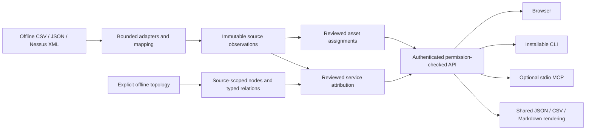

# Vulncat architecture

This document describes the current modules and data-integrity rules. Validation results for the private migration are recorded separately in [VALIDATION.md](../VALIDATION.md).

## Offline evidence and service attribution

Vulncat concatenates offline source signals into an evidence workspace. Persistent source observations distinguish inventory facts, native vulnerability occurrences and scan coverage. Reviewed asset assignments and service attributions are separate mutable projections over immutable evidence. The legacy scanner backlog and maintenance reports remain supported.

The service graph distinguishes assets/devices, load balancers, VIPs, logical services and observed endpoints. An endpoint can record protocol, port, DNS, SNI and network scope. Source-native IDs scope node identity; addresses and names never establish a graph identity or backend relationship. Explicit, reversible decisions create typed relations and finding attribution. Failed coverage cannot retire assets or resolve vulnerabilities.

Normal operation has no external API calls, telemetry, reverse DNS, probes or source credential storage. CLI and optional MCP stdio connect to the same existing authenticated application API. MCP does not start a listening server.

## Service topology

The Docker Compose deployment contains three required services:

- `web`: FastAPI REST API plus the compiled React single-page application.
- `worker`: the same application image running a PostgreSQL-backed durable-job worker.
- `db`: PostgreSQL with a persistent volume.

The browser uses one application origin at `http://localhost:8787`. Uploaded source files and generated
reports use separate persistent volumes. The web and worker containers run as a non-root user.

## Technology choices

### Backend

- Python 3.12
- FastAPI
- Pydantic 2
- SQLAlchemy 2
- Alembic
- PostgreSQL 16
- psycopg 3
- Argon2id password hashing
- defused XML parsing for Nessus XML
- XlsxWriter in constant-memory mode for XLSX reports

### Frontend

- React
- TypeScript
- Vite
- TanStack Query
- TanStack Table
- Mantine for restrained administrative components

### Validation

- Pytest for backend unit and integration tests
- Ruff and mypy for Python lint/type checking
- Vitest and Testing Library for frontend tests
- Playwright for browser end-to-end tests

## Core modules

The backend package layout is:

```text
backend/vulnbatch/
  api/              Versioned REST routers and dependencies
  core/             Configuration, security, CSRF, logging
  db/               SQLAlchemy session and models
  imports/          Detection, parsers, normalization, processing
  identity/         Identifier normalization and conservative reconciliation
  findings/         Finding identity, lifecycle, maturity, and SLA
  queries/          Canonical host-query models and SQL builder
  exports/          Scope snapshotting and report generation
  reconciliation/   Offline evidence, review, assignments and history
  exposure/         Explicit service graph, attribution and history
  client/           Shared authenticated CLI/MCP API client
  jobs/             PostgreSQL queue claiming and worker dispatch
  audit/            Structured audit event helpers
```

## Shared domain contracts



`reconciliation/` owns import deduplication, deterministic asset review, revision guards and assignment history. `exposure/` owns node facts, topology, attribution, decisions and guarded undo. Both acquire the existing `reconciliation_state` row lock and advance its revision, so a preview becomes stale after any competing identity or exposure write. Existing per-entity versions prevent stale overwrites. Replays bind request keys to exact payload and actor.

`client/` is the shared CLI/MCP transport and bounded service layer. It uses existing session cookies, CSRF and role checks. Reads are paged, writes require explicit confirmation and current revision/version checks. The CLI remains usable without the optional MCP dependency. `reporting.py` supplies the same report rows and tabular renderer to API exports and command interfaces.

Exposure tables are additive in migration `0003`: three current projections (`exposure_nodes`, `exposure_relationships`, `exposure_attributions`) and three immutable history tables (`exposure_node_facts`, `exposure_decisions`, `exposure_versions`). Existing observations, assignments, findings and legacy tables are preserved. Current facts do not replace immutable source rows. See [service semantics](service-exposure.md) for precise report and undo rules.

## Data model

The initial migration defines the following groups.

### Security and configuration

- `roles`
- `users`
- `user_sessions`
- `login_attempts`
- `application_settings`
- `audit_events`

### Assets and identity

- `assets`
- `asset_identifiers`
- `asset_identifier_observations`
- `asset_tags`
- `identity_review_items`
- `identity_events`

`assets.id` is the only canonical asset key. Scanner identifiers, hostnames, IP addresses, MAC addresses,
and aliases are separate evidence records.

### Imports and immutable evidence

- `source_files`
- `import_profiles`
- `imports`
- `import_records`
- `jobs`

The SHA-256 hash of a source file is unique for normal imports. A force-reprocess operation creates a new
import execution referencing the same immutable source file rather than copying or modifying it.

### Findings

- `vulnerability_definitions`
- `asset_findings`
- `finding_observations`
- `finding_status_history`
- `finding_notes`

A vulnerability definition is keyed by scanner source and plugin ID. An asset finding is keyed by canonical
asset, scanner source, plugin ID, normalized port, and normalized protocol. Plugin name and CVE values are
metadata and cannot create duplicate finding instances.

### Queries and exports

- `saved_views`
- `export_jobs`
- `export_asset_snapshots`
- `export_finding_snapshots`

Both asset IDs and finding IDs are snapshotted at submission time together with the denormalized report
projection used by the generator. This is stronger than re-running a mutable query or looking up mutable rows
later, and prevents a queued report from changing when host metadata, saved views, finding status, or new
imports change before generation.

## Asset identity decisions

### Identifier normalization

- Hostnames are trimmed, lowercased, and stripped of a trailing period.
- FQDN and short hostname remain distinct identifier types.
- IP values are normalized with Python's standards-compliant `ipaddress` library.
- MAC addresses are normalized to lowercase colon-separated octets.
- Blank strings, common scanner placeholders, malformed addresses, and malformed MAC values become null.
- The original scanner-controlled value remains preserved in the observation evidence.

### Matching precedence

Automatic evidence is evaluated from strongest to weakest:

1. Tenable asset UUID or Agent UUID.
2. Hardware/BIOS UUID.
3. MAC address.
4. FQDN.
5. Manually verified short hostname.
6. Unique eligible IP history.
7. Weighted combination of short hostname, IP, operating system, and prior observations.

A weaker match can never override a conflict involving a stronger identifier. Ambiguous or conflicting
evidence creates an `identity_review_items` row and leaves the incoming record unmerged until resolved.

### IP-only association

An IP-only observation may attach automatically only when:

- exactly one active, eligible asset association exists;
- no stronger identifier conflicts;
- the IP has not appeared on another asset inside `IP_ASSOCIATION_STALENESS_DAYS`;
- the current import does not pair the IP with a different hostname or UUID;
- the evidence exceeds the configured threshold; and
- the IP is not manually marked shared or non-identifying.

The default staleness window is 90 days.

### Manual decisions

Manual verification, rejection, pinned names, shared-IP declarations, merge, split, identifier moves, and
undo operations create durable identity events. Manual overrides are checked before automatic matching and
remain effective until explicitly removed.

Merge is never a destructive row collapse. One asset becomes an inactive redirect to the surviving canonical
asset, and affected identifiers/findings retain event provenance. Undo replays the recorded ownership changes.

## Finding lifecycle decisions

Supported statuses are:

- `open`
- `new_or_maturity_deferred`
- `planned`
- `in_progress`
- `not_observed`
- `remediated`
- `risk_accepted`
- `false_positive`
- `not_applicable`

Absence from a normal or partial import never marks a finding remediated. Authoritative reconciliation is
permitted only when an administrator marks an import complete and comparable and the imported scope proves
that the canonical asset was included. The strongest automatic absence state is `not_observed`.

If a finding in `not_observed` or `remediated` is observed again, it returns to `open` and receives a reopened
history event. The earliest reliable First Found value is monotonic and never reset by later imports.

## Maturity and SLA decisions

Maturity and environmental SLA are independent clocks.

Maturity date source precedence:

1. CVE publication date.
2. Vendor advisory or patch release date.
3. Plugin publication date.
4. Plugin modification date.
5. First Found only when `ALLOW_FINDING_DATE_MATURITY_FALLBACK` is enabled.

Upload time is never a maturity date. Default maturity gate is 30 calendar days.

SLA age starts from the earliest reliable First Found date for the asset finding. Defaults are 60 days for
Medium and 90 days for Low.

## Canonical host-query contract

`HostQueryV1` is the only host-filter contract. The host list endpoint, preview, saved views, select-all-matching,
and export submission all call the same normalization and SQL-building service.

Semantics:

- AND between filter categories.
- OR between values in the same category.
- explicit `any` or `all` tag matching.
- case-insensitive normalized hostname comparison.
- normalized IP comparison with `current`, `history`, or `both` scope.
- strict allowlists for filters and sort fields.
- deterministic `asset_id` tie-breaker.
- no implicit browser-page filters.
- bounded free text only across documented hostname, alias, IP, and scanner identifier fields.

Saved views and exports persist `query_schema_version=1`.

## Export scope and provenance

Every export uses exactly one asset scope:

- `selected_assets`
- `host_query`
- `saved_view`

Finding scope is a separate typed object. Mixed asset scopes are rejected by Pydantic validation.

Preview resolves the normalized query, total host count, a bounded sample, estimated finding count, and
warnings. Zero-result requests are rejected by default. Very large exports require explicit confirmation at
the configured threshold.

Submission performs one transaction that:

1. checks permission and validates the asset and finding scopes;
2. resolves the full canonical asset set;
3. resolves the matching finding set;
4. persists asset and finding snapshot rows;
5. stores original and normalized query JSON, schema version, counts, saved-view revision, and data-as-of time;
6. creates the durable export job and audit event.

The worker reads snapshot rows only. It never re-runs a saved view or ad hoc query.

XLSX uses constant-memory generation and contains:

- `Host Summary`
- `Finding Detail`
- `Export Metadata`

Every scanner-controlled or user-controlled spreadsheet value is formula-injection protected. CSV and
printable HTML use the same snapshots and include equivalent metadata. Output files are hashed with SHA-256.

## PostgreSQL-backed job queue

The `jobs` table stores import, export, and cleanup work. Workers claim jobs with
`SELECT ... FOR UPDATE SKIP LOCKED`, set a lease/heartbeat, and commit state transitions.

Retry creates no duplicate domain state:

- import processing is keyed to source evidence and observation uniqueness;
- export generation writes to a temporary path and atomically promotes one artifact reference;
- completed jobs are not reclaimed;
- expired leases may be reclaimed with an incremented attempt counter.

## Authentication and authorization

The application starts in setup mode only while no active administrator exists. The first-run endpoint requires
a strong user-supplied password and creates no universal credential.

Passwords use Argon2id. Server-side sessions use a random token whose hash is stored in PostgreSQL. Cookies are
HttpOnly, SameSite=Lax, and Secure when configured. Mutating requests require a per-session CSRF token.

Roles:

- `administrator`: imports, identity decisions, metadata changes, settings, user administration, and exports.
- `read_only`: view and permission-checked export preview/status/download where policy allows; no mutation of
  inventory or configuration.

Login attempts are throttled by normalized username and client address without recording plaintext passwords.

## Retention and deletion

Imported evidence has no automatic deletion by default. Report artifacts have configurable expiry while their
audit and export metadata remain. Any future destructive retention operation must be explicit, audited, and
limited to configured artifact classes.

## Deployment and migrations

The web entrypoint waits for PostgreSQL, applies Alembic migrations, then starts Uvicorn. The worker waits for
the same migration head before claiming jobs. Migrations may add structures but must not silently merge,
delete, or reinterpret asset/finding data.

Backup helpers wrap `pg_dump` and `pg_restore` against the Compose database service. Restore documentation
requires a disposable target or explicit operator confirmation.

## Implementation limits

- PostgreSQL is required in development and deployment; SQLite is not a supported substitute for integration
  behavior involving queue claims, JSONB, or concurrent snapshots.
- PDF reports remain best-effort. Printable HTML is the core portable print format.
- Electron is not implemented. Desktop work requires the browser application checks to pass first.
- Zero-result exports are rejected rather than creating a misleading empty artifact.
- The initial large-export confirmation threshold is configurable and defaults to 10,000 matching findings.
